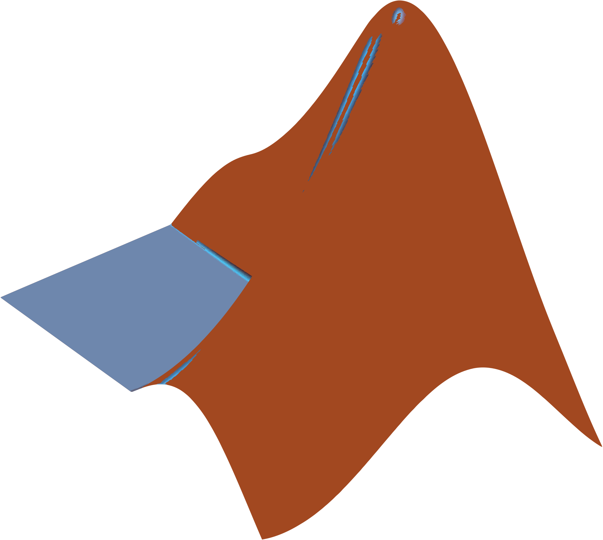

# Hi, I'm Darren 

🎓 Computer Engineering student  
📍 Toronto, Canada  
💻 Interested in software, hardware, and building things that actually work  

## 🚀 About Me
I'm a third year Computer Engineering student exploring the intersection of **software, hardware, and problem-solving**.  
Currently focused on strengthening my fundamentals, building small projects, and learning by doing.

I’m especially interested in:

- Low-level programming & system-level thinking

- Edge AI, Edge Computing & IoT systems

- Digital logic & computer architecture

- Signal processing & TinyML

- Turning theory into practical implementations

## 🛠 Tech Stack

### 💻 Languages

         

### 🔧 Hardware/Embedded

  
  

  <!-- Edge Impulse -->
  

 ARM Cortex-M4 • FPGA (Altera) • SPI • I2C • PWM • ADC Finite State Machines • Digital Logic • Real-Time Systems • DSP / MFCC 

### 🌐 Web & Backend

     

### ☁️ Cloud & Tools

     

Quartus • CodeWarrior • JUnit • JavaFX • NumPy • pandas • Matplotlib

